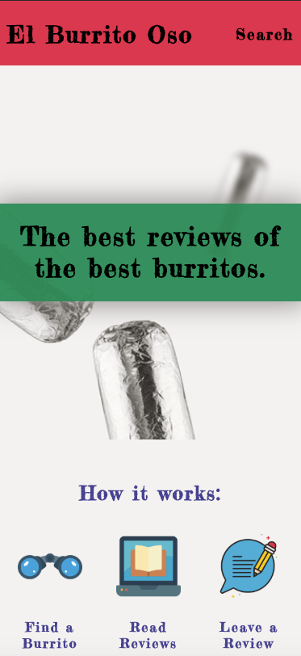
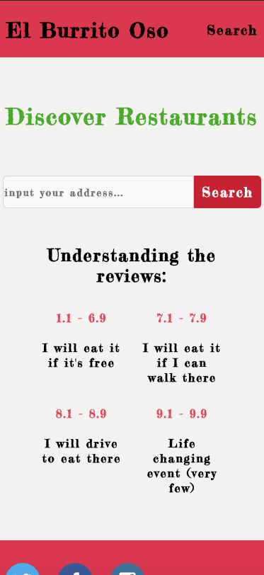
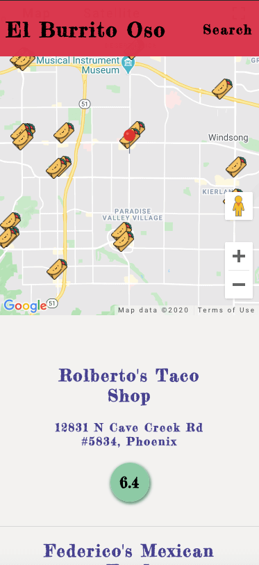
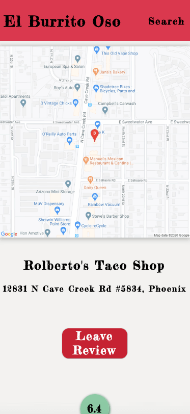
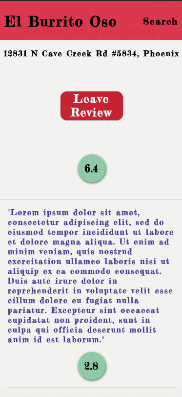
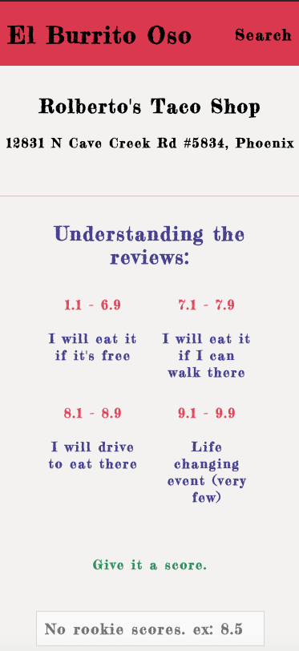
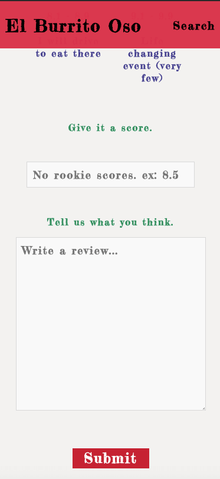
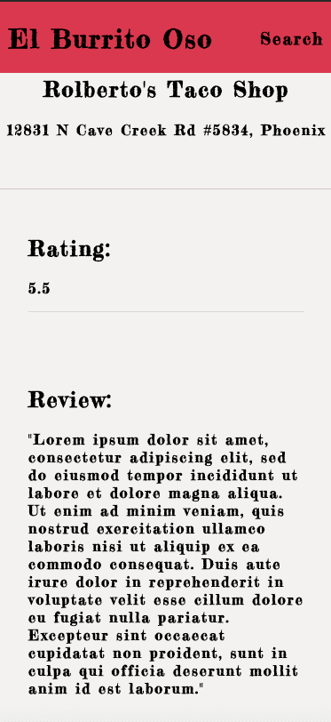

# El Burrito Oso

### Table of Contents

- [Live](#Live)
- [Description](#Description)
- [Screen Shot](#Screen-Shot)
- [Technologies](#Technologies)
- [Author](#Author)

---

## Live

[Live Site](https://el-burrito-oso-m674j6lrr.now.sh/)

---

## Description

This app was created in order to help user find the best burritos based off the address they input. Specifically a user will find a restaurant based on their given address, read reviews of other users, and once the user try's a restaurant the user will leave a review. The flow of the app starts with in instruction screen, for which the user selected to go to the search screen. From the search screen a rating scale map is given to help user understand the quality of review scores. Once the user inputs and address the Map will render, with location information, along with a list of the hits and rating scores. If a user would like to read all reviews or leave a review they will select the restaurant, which will take them to the restaurants details. In restaurant details the user may read reviews, see individual scores, location information, they will see the location populated on a static map, and have the option of leaving a review. Should a user choose to leave a review the user will click leave review, provide the prompted information than confirm. The user will confirm the information and then it will send off to the database.

---

## Screen Shots

 

 
 
 
 
 
 

---

## Technologies

#### Front-End

- React.js
- RESTful api
- Context
- React-Router

#### Back-End

- Node.js
- Express
- KNEX
- PostgreSQL

#### Api

- Google Geo Api
- Google Places Api
- Google Maps Api

#### Testing

- Jest
- Mocha
- Chai
- Chai-http

## Author

- Jon Kimmel - Front and Back-End
- Website - www.JonathonKimmel.com

[Back To Top](#El-Burrito-Oso)
